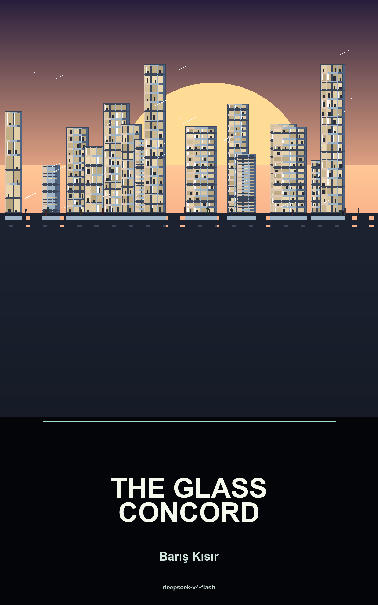

# The Glass Concord

**Genre:** Transparency Utopia

In the Concord, every wall is glass and every record is public -- until Inspector Mara Torez investigates the first confirmed crime in seventy years and must navigate a society that has no concept of investigation, no forensic tradition, and a killer hiding in plain sight.

**By Barış Kısır**

[Download EPUB](epub/The_Glass_Concord.epub)
