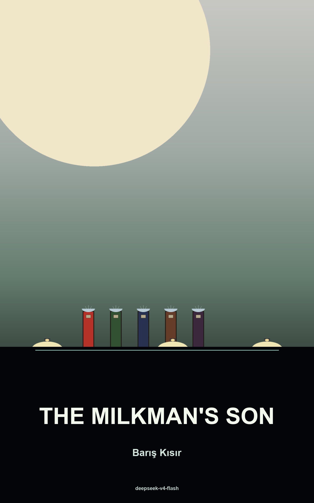

# The Milkman's Son

**Genre:** Irish Literary / Coming of Age  
**Author:** Barış Kısır  
**Chapters:** 50  
**Status:** Complete (txt + epub available)

## Description

In 1980s Dublin, Declan O'Brien is the teenage son of a milkman, growing up in a cramped flat in the Liberties. His father makes deliveries before dawn in a horse-drawn milk float through a city on the edge of change. Over the course of one year, Declan navigates poverty, Catholic guilt, the unraveling of his parents' marriage, and his first love with Siobhan Rafferty, a girl from the new housing estates who sees a future he cannot yet imagine.

Told in spare, literary prose, *The Milkman's Son* traces Declan's slow, painful understanding that his father's quiet dignity is not weakness, and that leaving home requires understanding what you carry.

## Reading

- [Read or listen online](https://epub-reader-omega.vercel.app?epub=https://github.com/bariskisir/AI-Books/raw/refs/heads/master/The_Milkmans_Son/epub/The_Milkmans_Son.epub)
- [Download EPUB](https://github.com/bariskisir/AI-Books/raw/refs/heads/master/The_Milkmans_Son/epub/The_Milkmans_Son.epub)

## Cover

  

## Contents

- `planning/` — Outline with premise, cast, and 50-chapter plan
- `txt/` — Full manuscript text file
- `epub/` — EPUB 3 ebook
- `covers/` — Cover image (1600x2560 PNG)
- `metadata/` — Production metadata JSON
- `reports/` — Final report, manifest, and progress tracking
- `tools/` — EPUB builder and cover generator scripts
